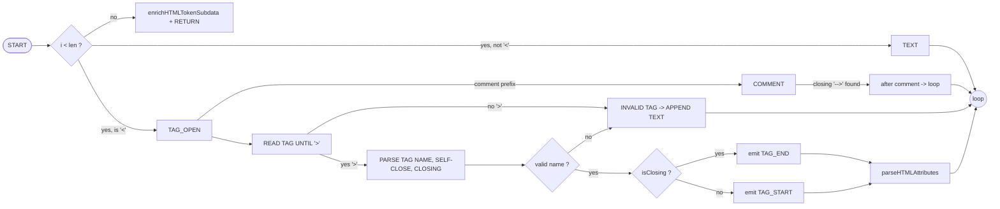
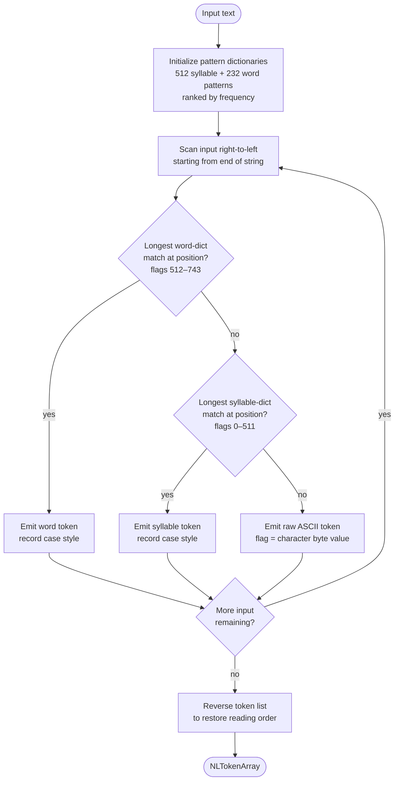
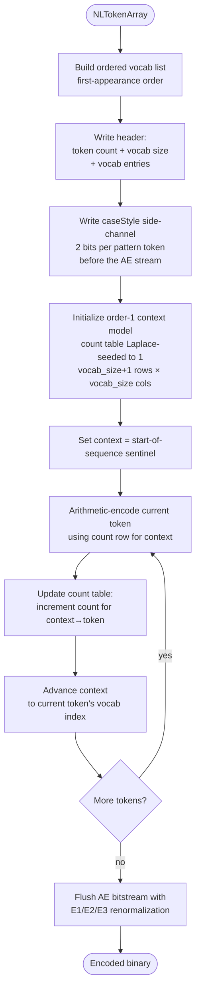
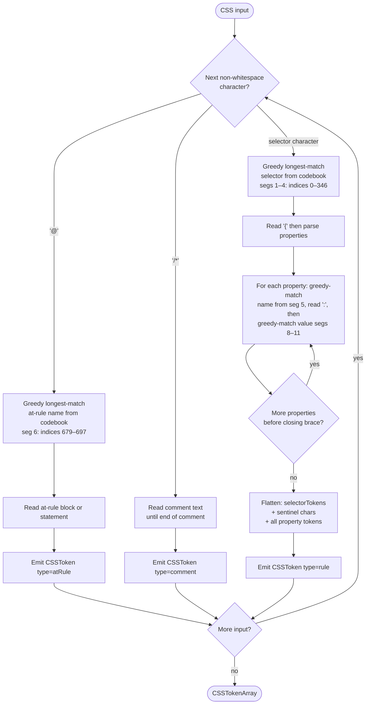
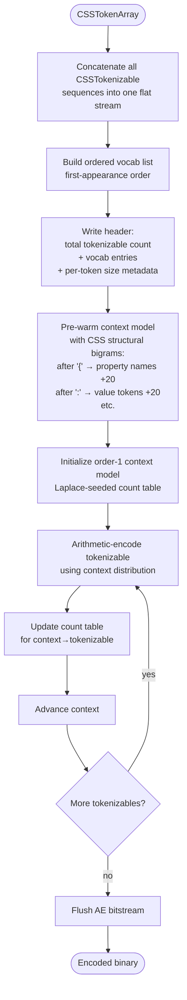
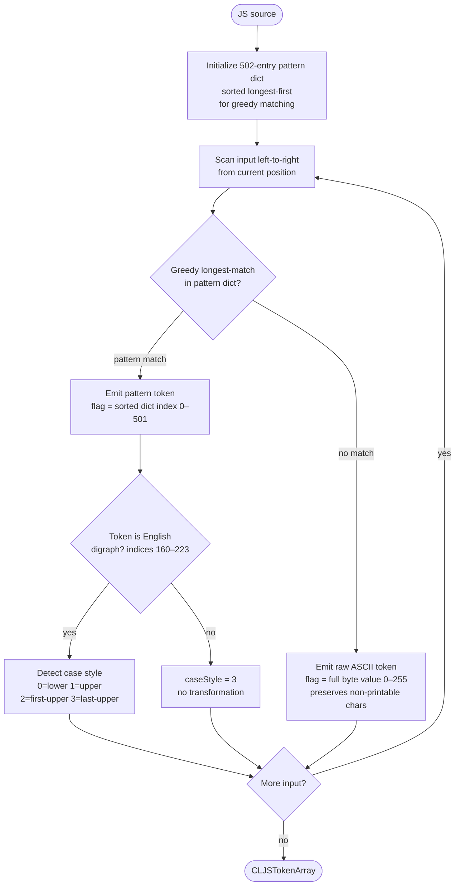
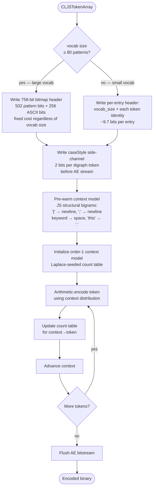
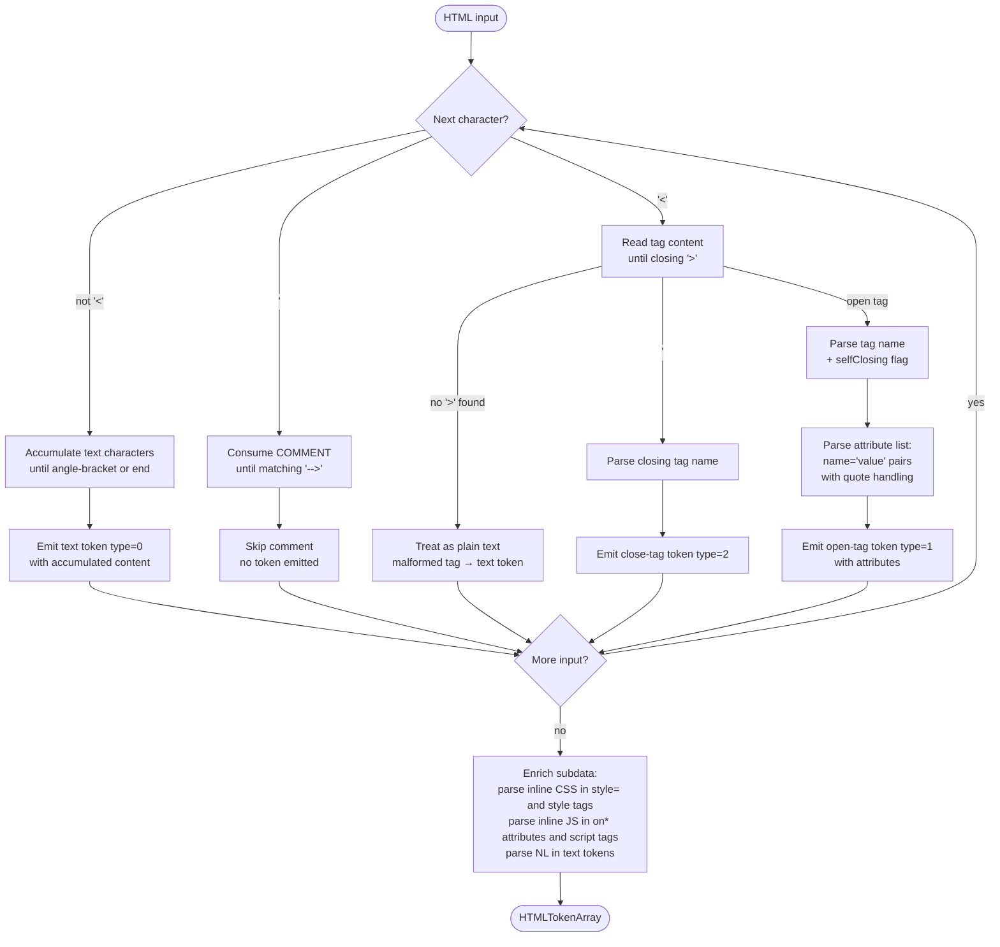
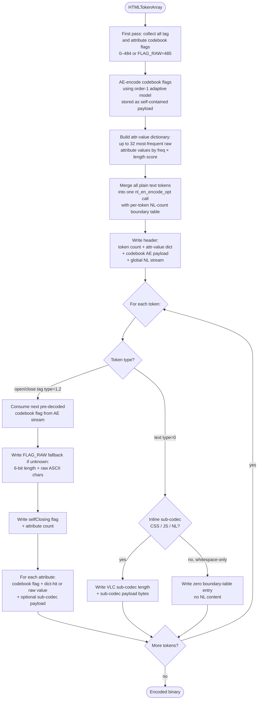

# htmlcodec-c
A library for compressing and decompressing texts with HTML symbols

# Design
The library uses a greedy dictionary approach to scan input text for HTML codes such as tags and attributes, and compress them to a single byte.
A pre-built dictionary of HTML tags and attributes are used to compress the data. 

# Algorithm
## Token extractions

## Decompression
### Data format
Data is read in sequence of 10-bits segments where the first two bits define how the next bits will be decoded.
| Two bits header value | Meaning |
|-----------------------|---------|
| 0x0 | Decode next 8 bit as ASCII |
| 0x1 | Decode next 9 bits as HTML tags |
| 0x2 | Decode next 9 bits as HTML attribute |
| 0x3 | Decode next 8 bits as common MIME type |

---

# Usage

## Latest Releases

Pre-built binaries are available on the [GitHub Releases page](https://github.com/yk001nul/htmlcodec-c/releases).

| Platform | Executable | Shared Library |
|----------|------------|----------------|
| Windows  | `.exe`     | `.dll`         |
| Linux    | *(no extension)* | `.so`    |

Download the appropriate files for your platform and architecture (x64, x86, arm64).

## Command-Line Usage

```
htmlcodec-c text [-f] [-d] [-l format] [-a] [outputpath]
```

| Argument | Description |
|----------|-------------|
| `text` | The raw text to encode or decode. When `-f` is used, this is treated as a file path instead. |
| `-f` | Read input from a file rather than the command-line argument. |
| `-d` | Decode mode. Without this flag the tool encodes by default. |
| `-l format` | Select the codec: `EN` (English/Dutch text, default), `HTML`, `CSS`, or `JS`. |
| `-a` | Write raw binary bytes to the output instead of a hexdump. Redirect to a file with `outputpath` to avoid garbled terminal output. |
| `outputpath` | Write the result to this file instead of the console. |

**Examples:**

```bash
# Encode English text and show hexdump
htmlcodec-c "The quick brown fox jumps over the lazy dog"

# Encode an HTML file to a binary output file
htmlcodec-c mypage.html -f -l HTML -a mypage.hce

# Decode a binary file back to HTML
htmlcodec-c mypage.hce -f -d -l HTML

# Encode a CSS file and show hexdump
htmlcodec-c styles.css -f -l CSS

# Encode a JavaScript file to raw bytes
htmlcodec-c app.js -f -l JS -a app.jce

# Decode a hex string in-place (paste hexdump output directly)
htmlcodec-c "4865 6c6c 6f" -d
```

**Decode input format:** In non-file mode (`-d` without `-f`), the `text` argument is parsed as a hex string — non-hex characters such as spaces, colons, and newlines are ignored. This means you can paste a hexdump directly as input.

## Using the Shared Library from Python

The shared library exposes a C API callable via Python's `ctypes`. The example below uses `process_opts` — the same function the CLI uses — to encode and decode text without writing any tokenizer code yourself.

```python
import ctypes
import ctypes.util
import platform

# Load the shared library
if platform.system() == "Windows":
    lib = ctypes.CDLL("htmlcodec-c-shared.dll")
else:
    lib = ctypes.CDLL("./libhtmlcodec-c-shared.so")

# Mirror the CmdlineOpts struct from cmdline.h
class CmdlineOpts(ctypes.Structure):
    _fields_ = [
        ("text",        ctypes.c_char_p),
        ("file_flag",   ctypes.c_int),
        ("decode_flag", ctypes.c_int),
        ("format",      ctypes.c_char * 8),
        ("ascii_flag",  ctypes.c_int),
        ("outputpath",  ctypes.c_char_p),
    ]

# Configure function signatures
lib.process_opts.restype  = ctypes.c_int
lib.process_opts.argtypes = [
    ctypes.POINTER(CmdlineOpts),
    ctypes.POINTER(ctypes.c_char_p),
    ctypes.POINTER(ctypes.c_size_t),
]

# Load the C runtime free() for releasing library-allocated buffers
if platform.system() == "Windows":
    libc = ctypes.CDLL("msvcrt")
else:
    libc = ctypes.CDLL("libc.so.6")
libc.free.argtypes = [ctypes.c_void_p]


def encode(text: str, fmt: str = "EN") -> bytes:
    opts = CmdlineOpts()
    opts.text        = text.encode("utf-8")
    opts.format      = fmt.encode("utf-8")
    opts.decode_flag = 0
    opts.ascii_flag  = 1

    out_ptr = ctypes.c_char_p()
    out_len = ctypes.c_size_t()
    rc = lib.process_opts(ctypes.byref(opts),
                          ctypes.byref(out_ptr),
                          ctypes.byref(out_len))
    if rc != 0:
        raise RuntimeError("encode failed")
    data = ctypes.string_at(out_ptr, out_len.value)
    libc.free(out_ptr)
    return data


def decode(data: bytes, fmt: str = "EN") -> str:
    opts = CmdlineOpts()
    opts.text        = data.hex().encode("utf-8")  # pass as hex string
    opts.format      = fmt.encode("utf-8")
    opts.decode_flag = 1
    opts.ascii_flag  = 1

    out_ptr = ctypes.c_char_p()
    out_len = ctypes.c_size_t()
    rc = lib.process_opts(ctypes.byref(opts),
                          ctypes.byref(out_ptr),
                          ctypes.byref(out_len))
    if rc != 0:
        raise RuntimeError("decode failed")
    text = ctypes.string_at(out_ptr, out_len.value).decode("utf-8")
    libc.free(out_ptr)
    return text


# Example usage
encoded = encode("Hello, world!", "EN")
print("Encoded:", encoded.hex())
decoded = decode(encoded, "EN")
print("Decoded:", decoded)
```

## Using the Shared Library from C#

The example below uses P/Invoke to call the shared library from C#. The `CmdlineOpts` struct must match the C layout exactly.

```csharp
using System;
using System.Runtime.InteropServices;
using System.Text;

[StructLayout(LayoutKind.Sequential, CharSet = CharSet.Ansi)]
public struct CmdlineOpts
{
    public IntPtr text;        // const char*
    public int    file_flag;
    public int    decode_flag;
    [MarshalAs(UnmanagedType.ByValTStr, SizeConst = 8)]
    public string format;      // char[8]
    public int    ascii_flag;
    public IntPtr outputpath;  // const char* (NULL = stdout)
}

public static class HtmlCodec
{
    // Windows uses the .dll name; Linux uses the .so name
#if WINDOWS
    private const string LibName = "htmlcodec-c-shared.dll";
#else
    private const string LibName = "libhtmlcodec-c-shared.so";
#endif

    [DllImport(LibName, CallingConvention = CallingConvention.Cdecl)]
    private static extern int process_opts(
        ref CmdlineOpts opts,
        out IntPtr outData,
        out UIntPtr outLen);

    [DllImport(LibName, CallingConvention = CallingConvention.Cdecl)]
    private static extern void free(IntPtr ptr);  // re-exported from C runtime

    public static byte[] Encode(string text, string format = "EN")
    {
        IntPtr inputPtr = Marshal.StringToCoTaskMemAnsi(text);
        try
        {
            var opts = new CmdlineOpts
            {
                text        = inputPtr,
                format      = format,
                decode_flag = 0,
                ascii_flag  = 1,
            };

            int rc = process_opts(ref opts, out IntPtr outData, out UIntPtr outLen);
            if (rc != 0) throw new InvalidOperationException("Encode failed.");

            int len = (int)outLen.ToUInt32();
            byte[] result = new byte[len];
            Marshal.Copy(outData, result, 0, len);
            free(outData);
            return result;
        }
        finally
        {
            Marshal.FreeCoTaskMem(inputPtr);
        }
    }

    public static string Decode(byte[] data, string format = "EN")
    {
        string hex = BitConverter.ToString(data).Replace("-", "").ToLower();
        IntPtr inputPtr = Marshal.StringToCoTaskMemAnsi(hex);
        try
        {
            var opts = new CmdlineOpts
            {
                text        = inputPtr,
                format      = format,
                decode_flag = 1,
                ascii_flag  = 1,
            };

            int rc = process_opts(ref opts, out IntPtr outData, out UIntPtr outLen);
            if (rc != 0) throw new InvalidOperationException("Decode failed.");

            int len = (int)outLen.ToUInt32();
            string result = Marshal.PtrToStringAnsi(outData, len);
            free(outData);
            return result;
        }
        finally
        {
            Marshal.FreeCoTaskMem(inputPtr);
        }
    }
}

// Example
byte[] encoded = HtmlCodec.Encode("<p>Hello, world!</p>", "HTML");
Console.WriteLine("Encoded length: " + encoded.Length);
string decoded = HtmlCodec.Decode(encoded, "HTML");
Console.WriteLine("Decoded: " + decoded);
```

> **Note for Linux:** Replace the `#if WINDOWS` guard with a runtime check (`RuntimeInformation.IsOSPlatform`) and supply the `.so` path accordingly.

## Using the Shared Library from C++

Because all public headers include `extern "C"` guards, you can link the shared library directly from C++ without a wrapper.

```cpp
#include <iostream>
#include <vector>
#include <stdexcept>
#include <cstring>

// Include the shared library's public header.
// Ensure HTMLCODEC_API resolves to __declspec(dllimport) on Windows
// (i.e., do NOT define HTMLCODEC_BUILDING_DLL or HTMLCODEC_STATIC).
#include "cmdline.h"

// Helper: encode text and return raw bytes
std::vector<unsigned char> encode(const char* text, const char* format = "EN")
{
    // Build argv-style arguments
    const char* argv[] = { "app", text, "-l", format };
    int argc = 4;

    CmdlineOpts opts{};
    if (parse_cmdline_opts(argc, const_cast<char**>(argv), &opts) != 0)
        throw std::runtime_error("parse_cmdline_opts failed");
    opts.ascii_flag = 1;

    unsigned char* out_data = nullptr;
    size_t         out_len  = 0;
    if (process_opts(&opts, &out_data, &out_len) != 0)
        throw std::runtime_error("process_opts failed");

    std::vector<unsigned char> result(out_data, out_data + out_len);
    free(out_data);
    return result;
}

// Helper: decode raw bytes and return a string
std::string decode(const std::vector<unsigned char>& data, const char* format = "EN")
{
    // Convert bytes to hex string for the text argument
    std::string hex;
    hex.reserve(data.size() * 2);
    for (unsigned char b : data) {
        char buf[3];
        snprintf(buf, sizeof(buf), "%02x", b);
        hex += buf;
    }

    const char* argv[] = { "app", hex.c_str(), "-d", "-l", format };
    int argc = 5;

    CmdlineOpts opts{};
    if (parse_cmdline_opts(argc, const_cast<char**>(argv), &opts) != 0)
        throw std::runtime_error("parse_cmdline_opts failed");
    opts.ascii_flag = 1;

    unsigned char* out_data = nullptr;
    size_t         out_len  = 0;
    if (process_opts(&opts, &out_data, &out_len) != 0)
        throw std::runtime_error("process_opts failed");

    std::string result(reinterpret_cast<char*>(out_data), out_len);
    free(out_data);
    return result;
}

int main()
{
    auto encoded = encode("body { color: red; }", "CSS");
    std::cout << "Encoded " << encoded.size() << " bytes\n";

    std::string recovered = decode(encoded, "CSS");
    std::cout << "Decoded: " << recovered << "\n";
}
```

**Compile on Linux:**
```bash
g++ -std=c++17 example.cpp -L. -lhtmlcodec-c-shared -Wl,-rpath,. -o example
```

**Compile on Windows (MSVC):**
```bat
cl /std:c++17 example.cpp /I<include-dir> htmlcodec-c-shared.lib
```

---

# Natural Language (NL) Codec

The NL codec compresses English and Dutch prose by replacing syllable fragments and common words with compact dictionary indices, then applying an order-1 adaptive arithmetic encoder to exploit sequential patterns.

The syllable dictionary contains 512 entries structured across 12 sections (CV, CVC, CCV, CVCC, VC, VCC, CCC, prefixes, suffixes, non-syllable trigraphs, digraphs). An extended word dictionary adds 232 common English words (4–8 characters). All entries are ranked by expected frequency so the most common patterns receive the smallest index values.

## NL Tokenization



Case style is recorded per token: `0` = all-lower, `1` = all-upper, `2` = first-alpha-upper, `3` = last-alpha-upper. The case information is stored separately in a side-channel during encoding so it does not inflate the arithmetic coder's alphabet.

## NL Encoding



The optimised codec (Steps 1–4) omits per-symbol frequency from the header, strips caseStyle from the AE alphabet, uses the extended 232-word dictionary, and conditions each symbol on its immediate predecessor via the order-1 count table.

---

# CSS Codec

The CSS codec tokenizes stylesheets against a 1208-entry codebook (covering HTML-type selectors, attribute names, pseudo-classes, pseudo-elements, CSS properties, at-rules, combinators, keyword values, value functions, named colors, and named at-rule blocks), then uses adaptive arithmetic coding with CSS-domain bigram seeding to achieve high compression on structured CSS content.

## CSS Tokenization



Unrecognised tokens fall back to raw ASCII `CSSTokenizable` entries. The tokenizer stores the full flattened token stream (including `{`, `:`, `;`, `}` sentinels) so the decoder can reconstruct exact property boundaries without a separate structure header.

## CSS Encoding



The optimised codec (Steps 1–3) omits per-symbol frequencies from the header and pre-warms the context model with CSS structural transition knowledge before encoding begins, giving the arithmetic coder accurate initial priors even on the first symbol.

---

# JavaScript (JS) Codec

The JS codec tokenizes JavaScript source code against a 502-entry pattern dictionary covering ES2025 reserved keywords, common library/framework API tokens, digraphs, non-alphanumeric operator patterns, built-in identifiers, method-call patterns, operator sequences, and short verb/noun fragments. An order-1 adaptive arithmetic encoder with JS-domain bigram seeding is then applied.

## JS Tokenization



ASCII tokens store the full 8-bit byte value so non-printable characters such as `\n`, `\t`, and `\r` round-trip correctly — important for JavaScript source files where whitespace carries semantic meaning.

## JS Encoding



The bitmap header format is selected when vocab size reaches 80 entries — the break-even point where a fixed 758-bit bitmap becomes smaller than per-entry encoding. For typical production JS files with ~130 unique tokens, the bitmap saves roughly 60 bytes compared to per-entry encoding.

---

# HTML Codec

The HTML codec is a multi-layer compressor that handles HTML structure, inline CSS, inline JavaScript, and natural-language text content in a single pass. It uses a 485-entry flat codebook (112 standard HTML tag names + 118 HTML attribute names + 255 common MIME type strings), a global NL stream for all text tokens, and per-token sub-codecs for inline CSS and JS.

## HTML Tokenization



After the main parsing pass, `enrichHTMLTokenSubdata()` walks every token and attribute to parse inline CSS (in `<style>` elements and `style=` attributes), inline JavaScript (in `<script>` elements and `on*` event attributes), and natural-language content (in text tokens). Each sub-parse stores a typed pointer in the token's `subdata` union for use by the codec.

## HTML Encoding



Sub-codec payload lengths use variable-length coding (VLC): 8 bits for payloads up to 127 bytes, 16 bits for larger ones. This avoids wasting 4 bits per attribute on the fixed 12-bit length field that an earlier version used, and contributes significant savings on documents with many short attribute values.

---

# Performance Comparison

All measurements are from the unit test suite. Sizes are in bytes. "Reduction" is how much smaller the encoded output is compared to the raw input.

## Natural Language (EN) vs zlib

Input: 1091-byte English prose passage (552 tokens).

| Codec | Output | % of input | Reduction |
|-------|-------:|:----------:|----------:|
| NL variable-width | ~965 B | ~88% | ~12% |
| NL static AE | 936 B | 85.8% | 14.2% |
| NL optimised AE (Steps 1–4) | 826 B | 75.7% | 24.3% |
| zlib | ~658 B | ~60% | ~40% |

The optimised AE codec closes roughly half the gap between static AE and zlib by adding an order-1 context model, a caseStyle side-channel, and an extended 232-word dictionary. The remaining gap reflects per-syllable tokenisation overhead; further gains would require whole-word tokenisation at a larger vocabulary granularity.

## CSS vs zlib

| Input | Raw | CSS static AE | CSS optimised AE | zlib |
|-------|----:|:-------------:|:----------------:|:----:|
| Best case — repeated properties (32 B) | 32 B | 27 B (15.6% reduction) | 16 B (50.0% reduction) | 29 B (9.4% reduction) |
| Worst case — all-unique tokens (27 B) | 27 B | 34 B (−25.9%) | 20 B (25.9% reduction) | 35 B (−29.6%) |
| Long — realistic stylesheet (1382 B) | 1382 B | 632 B (54.3% reduction) | 480 B (65.3% reduction) | 563 B (59.3% reduction) |

On the long stylesheet the optimised CSS codec (65.3% reduction) outperforms both zlib (59.3%) and the static AE codec (54.3%). CSS-domain structural bigram seeding gives the context model accurate initial priors before any adaptation has occurred, which is especially effective on structured CSS where token transition patterns are highly regular.

## JavaScript (JS) vs zlib

| Input | Raw | JS AE opt | zlib |
|-------|----:|:---------:|:----:|
| Short script (60 B) | 60 B | 41 B (31.7% reduction) | 65 B (−8.3%) |
| Long script — React-style module (1921 B, 912 tokens) | 1921 B | 859 B (55.3% reduction) | 733 B (61.8% reduction) |

The JS codec beats zlib on the short input even below 100 bytes. On longer inputs zlib has an edge due to its sliding-window LZ compression, which can reference longer repeated byte sequences that the token-level AE model cannot exploit. The bitmap vocab header (fixed 758 bits for vocab size ≥ 80) is critical for JS files with large token vocabularies — it replaces roughly 1250 per-entry bits with a fixed-cost header, saving ~60 bytes on the header alone.

## HTML vs zlib

| Input | Raw | HTML AE (Steps 1–6) | zlib |
|-------|----:|:-------------------:|:----:|
| Short page — 5 tags with inline CSS (86 B) | 86 B | ~80 B | ~89 B |
| Long page — full webpage (3358 B, 235 tokens) | 3358 B | ~2028 B (39.6% reduction) | ~1070 B (68.1% reduction) |

The HTML codec beats zlib on the short input after codebook AE (Step 4) was introduced. On longer documents there remains a gap to zlib: the codec's structured per-token serialisation carries overhead that a byte-level compressor avoids. The realistic ceiling for this architecture is estimated at ~55–60% reduction on typical webpage documents, compared to zlib's ~68%.

